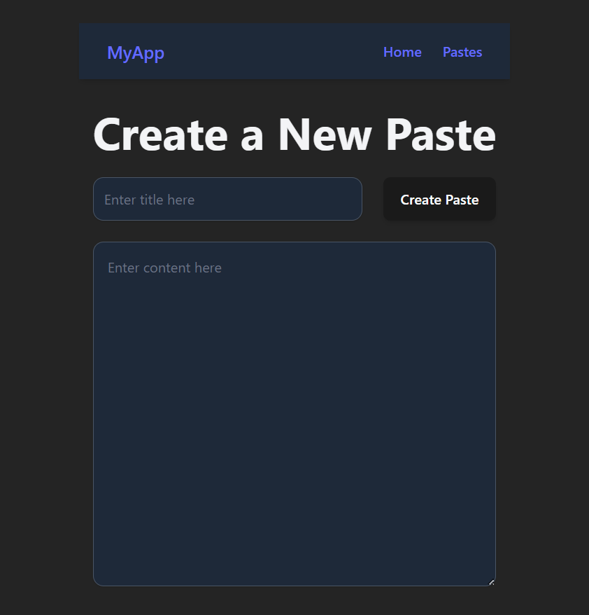
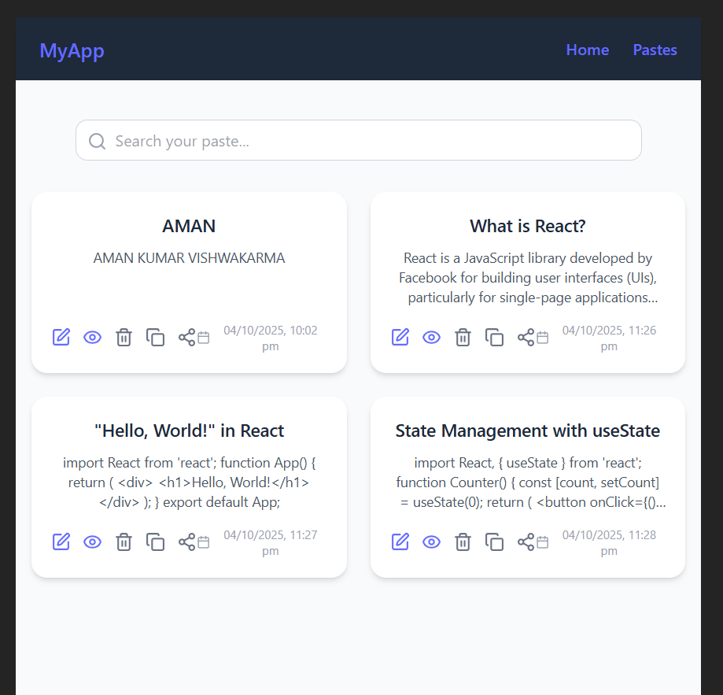

# 📝 Paste App

<p align="center">
  
</p>

<p align="center">
  <b>A simple and beautiful Paste App built with React, Tailwind CSS, Redux Toolkit, and LocalStorage.</b>
</p>

<p align="center">
  
  
  
  
  
  
</p>

---

## 📖 About the Project

**Paste App** is a lightweight and responsive web app for creating and managing text snippets or "pastes."  
It lets users **add, edit, view, copy, share, and update** content seamlessly — all powered by **LocalStorage** for instant persistence.

This project is perfect for students and developers who want to manage short notes, code snippets, or ideas directly in their browser.

---

## ✨ Features

✅ Add new paste  
✅ Edit & update existing pastes  
✅ Copy paste content to clipboard  
✅ Share paste content using a single button  
✅ View paste details in a separate page  
✅ Persistent data using LocalStorage  
✅ Modern and responsive UI using Tailwind CSS CDN  
✅ Notification support with React Toastify  
✅ State management using Redux Toolkit

---

## 🧠 Tech Stack

| Category | Tools Used |
|-----------|-------------|
| **Frontend** | React, HTML5, CSS3, JavaScript |
| **Styling** | Tailwind CSS (CDN) |
| **State Management** | Redux Toolkit |
| **Notifications** | React Toastify |
| **Storage** | LocalStorage |
| **Version Control** | Git & GitHub |

---

## ⚙️ Installation Guide

Follow these simple steps to set up the project locally 👇

### 1️⃣ Clone the Repository

git clone https://github.com/amankv1234/PASTE_APP.git
cd PASTE_APP

### 2️⃣ Install Dependencies
npm install
npm install @reduxjs/toolkit react-redux react-toastify

3️⃣ Run the Development Server

npm run dev

4️⃣ Open in Browser

Your app will run at:
👉 http://localhost:5173/

🚀 Usage

Click the “Add Paste” button to create a new paste.

You can edit, update, copy, view, and share pastes easily.

All your pastes are stored securely in your LocalStorage.

Reload or close your browser — your data stays safe!
## 📸 Screenshots

### 🏠 Home Page
<p align="center">
  
</p>

### ✏️ Add / Edit Paste
<p align="center">
  
</p>

💻 Folder Structure

PASTE_APP/
├── public/
├── src/
│   ├── components/
│   ├── redux/
│   ├── App.jsx
│   ├── main.jsx
│   └── index.css
├── screenshots/
│   ├── home.png
│   ├── add-edit.png
│   └── view.png
├── logo.png
├── package.json
└── README.md
## 🧩 Tools & Libraries Used

### 🛠️ Core Tools
<p align="left">
  
  
  
  
  
  
  
  
</p>

### 📦 Libraries & Frameworks
- **React** – UI framework for building interactive components  
- **Redux Toolkit** – Efficient state management  
- **React Toastify** – Notification system  
- **Tailwind CSS (CDN)** – Fast and responsive styling  
- **LocalStorage API** – Client-side storage  
- **JavaScript (ES6+)** – Core scripting  
- **HTML5 & CSS3** – Structure and design


  |
📢 Author

👨‍💻 Aman Kumar Vishwakarma
📍 Rajkiya Engineering College, Kannauj
📧 amankumarvishwakarma767@gmail.com
🪪 License

This project is licensed under the MIT License — free to use and modify!

<p align="center"> Made with Hard Work using <b>React, Redux Toolkit & Tailwind CSS</b> </p> ```
